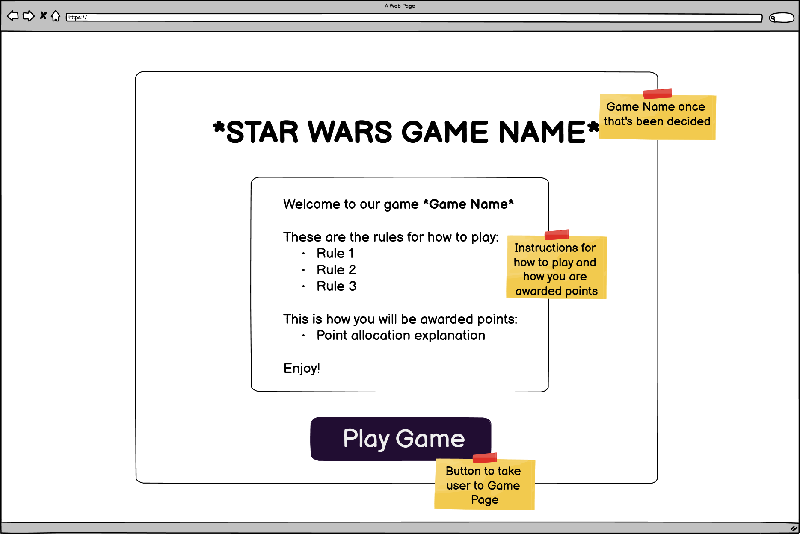
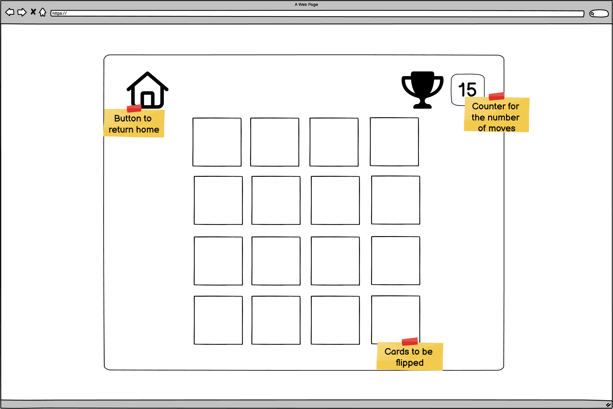

# Memory Wars
## Introduction

'Memory Wars' has been created as part of our team Sith-ly The Best's Stars Wars May 2023 Hackathon project. The idea was to create a memory card game similar to games that already exist. We aimed to create a game that would be enjoyable, fun, easy to play and starightforward and would encourage repeat playing. 

## User Stories
- As a player I can see a game board so that I can start playing the memory game
- As a user I can arrive on a home page with a short introduction and instructions so that I can understand how the game works.
- As a player I can click on a card to flip it over so that I can reveal the image underneath.

## Design
### Home Page Wireframe

### Game Page Wireframe

## Game Rules
- The game board consists of a grid of facedown cards and the aim of the game is to find all of the matching pairs of cards as quickly as possible and using the fewest number of moves.
- On each turn, the user can flip two cards to reveal their faces.
- If the two flipped cards have the same image, they remain face up and are considered a match.
- If the two flipped cards have different images, they are flipped back facedown.
- The game continues until all the cards are matched and facing up.

## Features
### Home Page

### Game Page

### Login Page

### Sign up Page

### Leaderboard

## Technologies
### Languages Used
- HTML
- CSS
- JavaScript
- Python

### Libraries, frameworks and programmes used
- Balsamiq: to create the wireframes
- Git: for version control
- GitHub: to save and store the code
- Google Fonts: to import the fonts used in the game
- 
- 
## Testing
### Validator Testing
- HTML:

- CSS:

- JavaScript:

- Python:

### Manual Testing

## Credits
### Media
- 
### Contributors
- [Johnny](https://github.com/Joao4569) (Scrum Master)
- [Alex](https://github.com/AVTpepper)
- [Darrach](https://github.com/DarrachBarneveld)
- [Dermot](https://github.com/IrishDermot)
- [Liam](https://github.com/lpewton)
- [Mohamed](https://github.com/moabdelbasset)
- [Nataliia](https://github.com/Natalitta)
- [Shivani](https://github.com/s-batish)